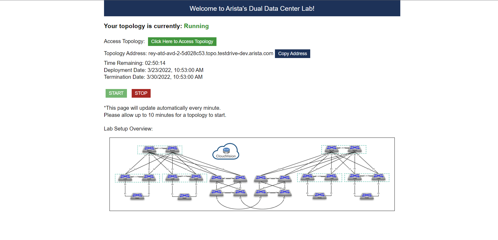
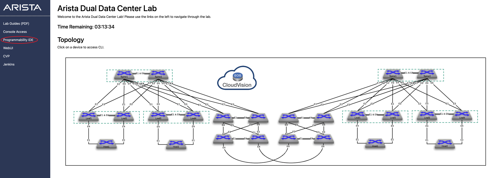
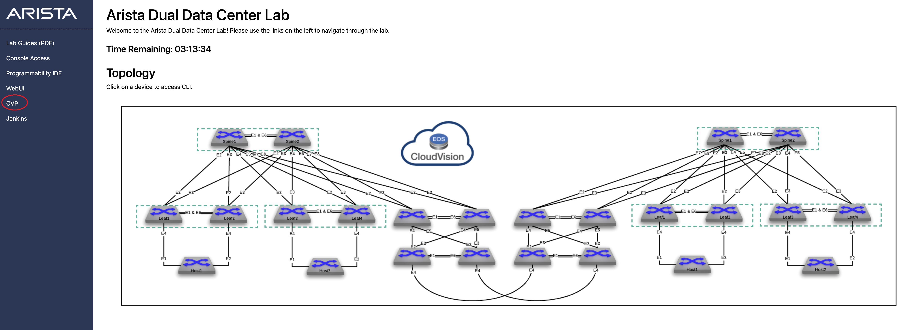
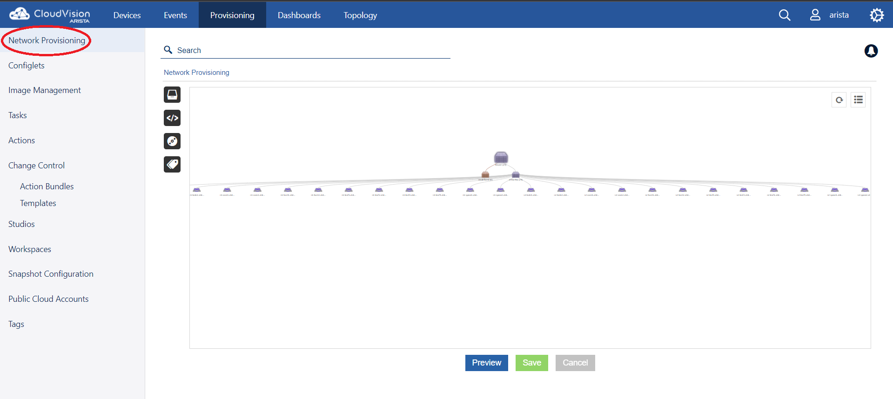
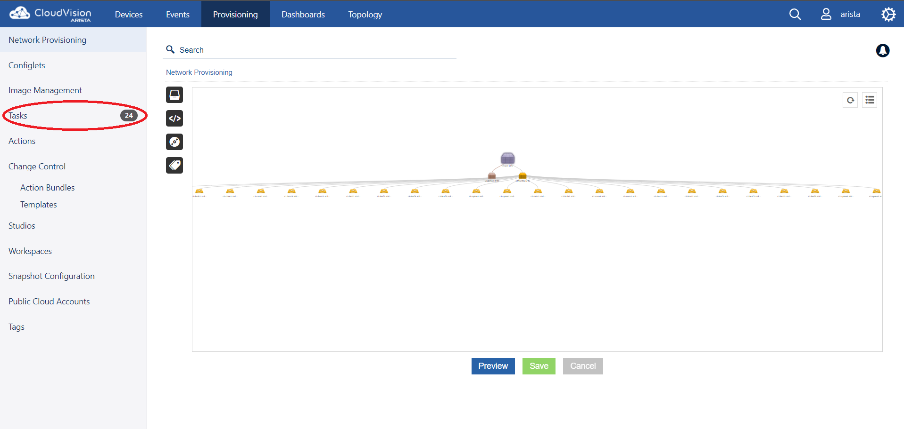
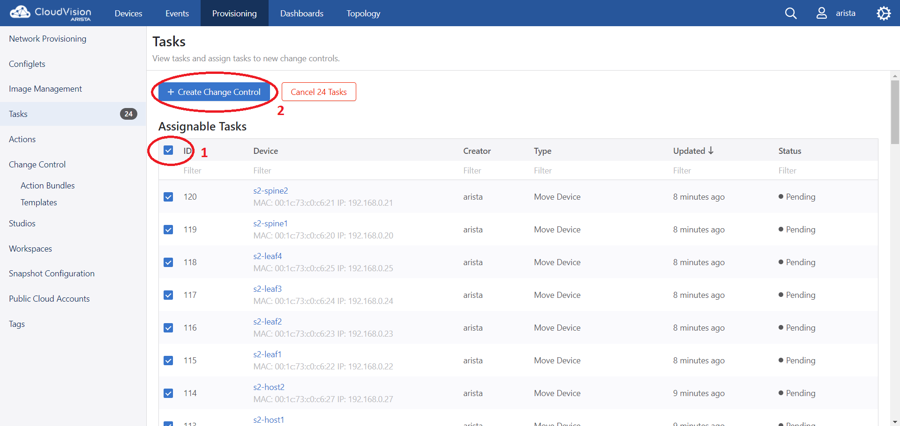
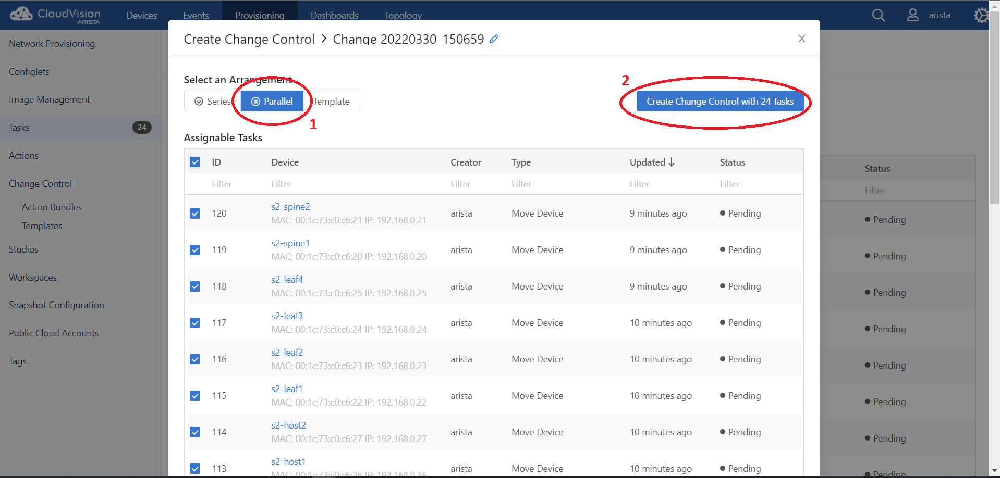
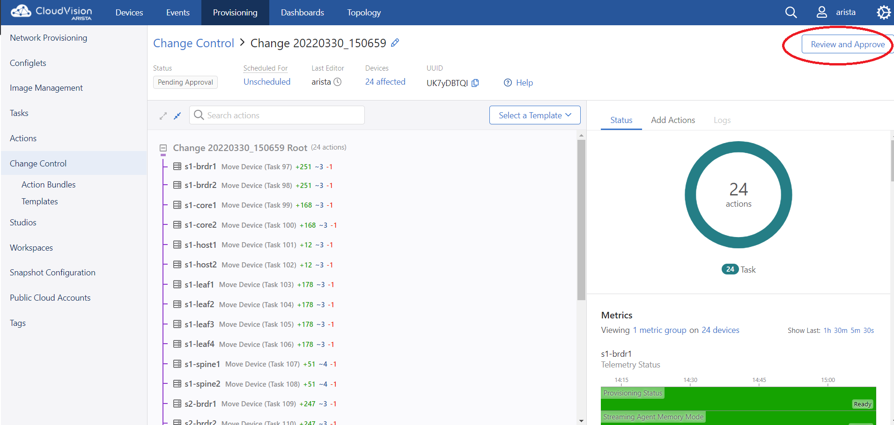
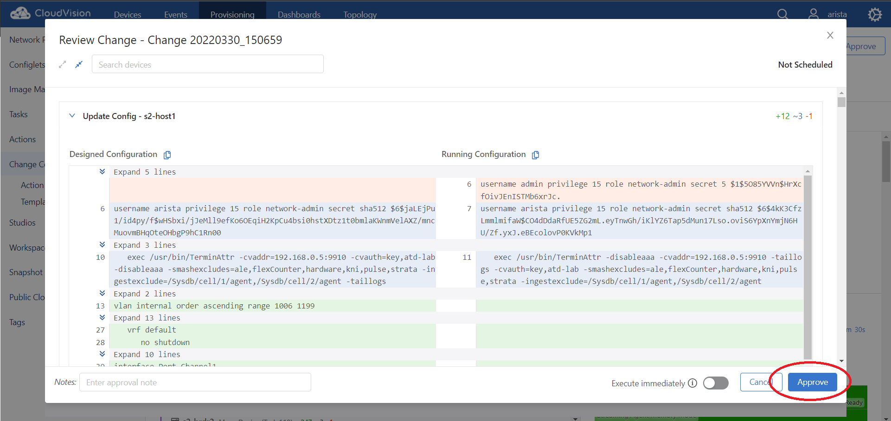
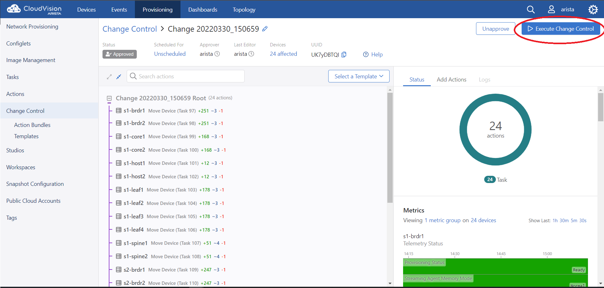

(NOTE: This document is still being updated)


# ATD-AVD Dual DataCenters Lab Guide

## Fabric Build Detailed Instructions:

### Step 1:

Open the link provided by Arista representative during registration. The provided link should provide a page similar to the image below.





Check and make sure that your topology is "Running". If not, pls. go ahead and click "START" to bring up the lab.

Note: Pls. take note of the Lab Credentials and Passwords, these are necessary to move to the next steps.

### Step 2:

Once the topology is running, you should be able to access your lab by clicking on "Click Here to Access Topology"

### Step 3:

Open your VScode by clicking "Programmability IDE" shown on the image below.

Enter the Programmability IDE password when prompted.





Using PWD command, check and make sure that you are inside the proper directory. If not, type "cd labfiles/AristaValidatedDesigns" to get into the correct directory.

```bash
➜  project pwd
/home/coder/project

➜  project cd labfiles/AristaValidatedDesigns
➜  AristaValidatedDesigns
```

### Step 4:

The first step is to setup the ATD environment. On the VScode terminal screen, type the "make atd-setup" command. The atd-setup command will run a series of ansible commands, such as installing the ansible collections, performing upgrade and running the ansible playbook that will setup the ATD.

```bash
➜  AristaValidatedDesigns make atd-setup
```

Password needs to be entered during this process, this will automatically setup the AAA account required to push all the configuration changes to the devices. The password can be found at the bottom area of the initial page.

Enter and confirm using the Lab Credentials password.

(This entire setup process would take between 15-20 minutes)

### Step 5:

The next step is building the Fabric configuration using the "make provision" command. This will generate all intended configurations, devices containers on CVP and all related documentation.

```bash
➜  AristaValidatedDesigns make fabric-provision
```

### Step 6:

This step will push all the generated configuration to the devices via CVP.

#### Step 6a:
From the initial screen, click on "CVP". This will open up a web session to the Arista Cloudvision station. Use the Lab Credentials username and password to login.





Under the Provisioning tab, click Network Provisioning, you should see all devices under "STAGING" container, shown below




Also, you will notice several tasks have been created after performing Step 5.



Click Tasks and select all assignable tasks and then click on "Create Change Control".



For faster deployment, you can select Parallel under Select an Arrangement, this will deploy changes to all the devices simulataneously 



Click Review and Approve



Approve the change control



And finally, execute the change control


